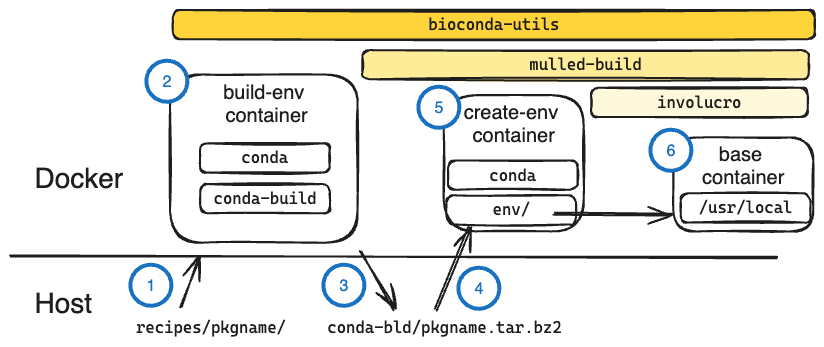

Dockerfile inventory
====================

Docker containers are used in multiple ways by bioconda-utils. Broadly, we can
divide them into containers used for *building* packages and containers used
for the bot.

Overview of containers used in building
---------------------------------------

Bioconda builds not only conda packages but also Docker containers with the
package installed. Here's how it works.

   Sketch of how containers and packages interact with :command:`bioconda-utils
   build --docker --mulled-test`. See below for details. [:download:`excalidraw
   <../images/bioconda-containers.excalidraw>`] [:download:`SVG
   <../images/bioconda-containers.svg>`]

If we run :command:`bioconda-utils build` without the :command:`--docker`
argument, it will build a conda package using the conda-build in the local
environment and the built package will appear in the host's :file:`conda-bld`
directory, ready for uploading to the channel.

However, the host may have libraries or packages installed that are not defined
in the recipe. If a package uses any of these, then even if tests pass on this
host they may fail on another machine that is missing those undeclared
dependencies, resulting in a broken package. Since we use multiple CI providers
(CircleCI, GitHub Actions, Azure DevOps), and since any one of these providers
may install or update libraries on their hosts at any time, there is a risk of
creating packages that work when building but are broken on other systems.

To guard against this, we run :command:`bioconda-utils build` with the
:command:`--docker` argument. This runs conda-build inside a Docker container,
isolating it from the host and preventing any host libraries from being used.
As before, the resulting package is found in the host's :file:`conda-bld`
directory.

When we additionally use the :command:`--mulled-test` argument,
:program:`bioconda-utils` will run :program:`mulled-build` from the `galaxy-lib
<https://galaxy-lib.readthedocs.io/en/latest/topics/mulled.html>`_ package.
:program:`mulled-build` is a tool to convert conda packages into Docker images.
It uses `involucro <https://github.com/involucro/involucro>`_ to make a final,
minimal image with a dramatically reduced file size.

This process uses two images: an image containing conda, and a minimal base
image. First, a container with conda installed is used to :command:`conda
install` the package built in the previous step into the container. This
installs the package's dependencies as well. The test commands are extracted
from the package, and run to test this newly-installed package. Next, *just the
conda environment directory* is extracted from the conda container and layered
onto the base image using :program:`involucro`.

The base image has very little else, not even conda. So the end result is
a minimal Docker image with nothing but the installed package and its
dependencies (and therefore a small size), ready to be uploaded to
a repository.

Details of containers using in building
---------------------------------------

The **build image** is used for *building* a package, isolated from the host.
The built package appears back on the host's local channel.

The **conda image** is used by mulled-build for *installing* the conda package
in such a way that the resulting conda env can be easily copied out by
involucro

The **base image** is used by involucro as a starting image into which it will
copy the conda env created by mulled-build in the conda image

The **extended base image** is used in rare cases where very minimal base image
is *too* minimal. In this case, recipe authors can specify
``container:extended-base:true`` in the meta.yaml file, and the extended image
will be used as the base instead.

Here are the images, their respective Dockerfiles, and where they are built.

.. list-table::
  :header-rows: 1
  :class: inventory

  * - description
    - image
    - maintained in
    - dockerfile
    - built by

  * - build image
    - ``quay.io/bioconda/bioconda-utils-build-env-cos7``
    - bioconda-utils
    - `Dockerfile <https://github.com/bioconda/bioconda-utils/blob/master/Dockerfile>`_
    - `GitHub Action workflow <https://github.com/bioconda/bioconda-utils/blob/master/.github/workflows/build-image.yml>`_

  * - conda image
    - ``quay.io/bioconda/create-env:latest``
    - bioconda-containers
    - `Dockerfile <https://github.com/bioconda/bioconda-containers/blob/main/images/create-env/Dockerfile>`_
    - `GitHub Action workflow <https://github.com/bioconda/bioconda-containers/blob/main/.github/workflows/create-env.yaml>`_

  * - base image
    - ``quay.io/bioconda/base-glibc-busybox-bash:3.0``
    - bioconda-containers
    - `Dockerfile <https://github.com/bioconda/bioconda-containers/blob/main/images/base-glibc-busybox-bash/Dockerfile>`_
    - `GitHub Action workflow <https://github.com/bioconda/bioconda-containers/blob/main/.github/workflows/base-glibc-busybox-bash.yaml>`_

  * - extended base image
    - ``quay.io/bioconda/base-glibc-debian-bash:3.0``
    - bioconda-containers
    - `Dockerfile <https://github.com/bioconda/bioconda-containers/blob/main/images/base-glibc-debian-bash/Dockerfile>`_
    - `GitHub Action workflow <https://github.com/bioconda/bioconda-containers/blob/main/.github/workflows/base-glibc-debian-bash.yaml>`_

As of Nov 2023, each of these is configured to be built on both amd64 and arm64
(a.k.a x86_64 and aarch64) architectures.

In the actual :program:`bioconda-utils` code, the containers are specified in
several ways. Note that the links to code below point to specific commits in
order to highlight a line, so these may not be the most up-to-date code. But it
can give you a starting point for where to look.

- The build image is configured in `bioconda_utils/cli <https://github.com/bioconda/bioconda-utils/blob/2c5d4ad754f7bfa17b90495dc602118c7270d4bc/bioconda_utils/cli.py#L473>`_.

- mulled-build pays attention to `env vars
  <https://github.com/galaxyproject/galaxy/blob/01c4de53162f4e4ee306ebdd008199a897222dc3/lib/galaxy/tool_util/deps/mulled/mulled_build.py>`_
  that define what images to use.

- `bioconda_utils.pkg_test.test_package()
  <https://github.com/bioconda/bioconda-utils/blob/2c5d4ad754f7bfa17b90495dc602118c7270d4bc/bioconda_utils/pkg_test.py#L172>`_
  sets DEST_BASE_IMAGE to the `base_image` arg, which in turn is set in
  `bioconda_utils.build.build()
  <https://github.com/bioconda/bioconda-utils/blob/2c5d4ad754f7bfa17b90495dc602118c7270d4bc/bioconda_utils/build.py#L125-L129>`_.
  This can take one of two hard-coded values, depending on if the recipe needed
  an extended image or not.

- mulled-build also needs a conda image to use. This is set by bioconda-utils
  in `pkg_test.py
  <https://github.com/bioconda/bioconda-utils/blob/2c5d4ad754f7bfa17b90495dc602118c7270d4bc/bioconda_utils/pkg_test.py#L20>`_
  which is then passed to `build.build
  <https://github.com/bioconda/bioconda-utils/blob/2c5d4ad754f7bfa17b90495dc602118c7270d4bc/bioconda_utils/build.py#L61>`_.

The bot
-------

The BiocondaBot responds to comments on PRs an interacts with some artifacts
created by package builds. In order to have rapid response times, the bot is
implemented as a set of tagged Docker containers.

The bot actions largely consist of relatively simple HTTP requests. The code
for these actions if maintained in the `src/bioconda_bot
<https://github.com/bioconda/bioconda-containers/tree/main/images/bot/src/bioconda_bot>`_
Python package, within the bioconda-containers repo. There are different tagged
images for the different behaviors of the bot, which are built and pushed in
the `bot.yaml
<https://github.com/bioconda/bioconda-containers/blob/main/.github/workflows/bot.yaml>`_
GitHub Action workflow in the bioconda-containers repo. For example, the
comment behavior on bioconda-recipes is defined `here
<https://github.com/bioconda/bioconda-recipes/blob/master/.github/workflows/CommentResponder.yml#L17-L44>`_,
which uses the ``quay.io/bioconda/bot:comment`` container, sets some env
variables that GitHub Actions has access to, and runs :command:`bioconda-bot
comment` in the container. This container was created `here
<https://github.com/bioconda/bioconda-containers/blob/main/.github/workflows/bot.yaml#L34-L46>`_,
when the `matrix.tag was set to "comment"
<https://github.com/bioconda/bioconda-containers/blob/main/.github/workflows/bot.yaml#L20>`_.
